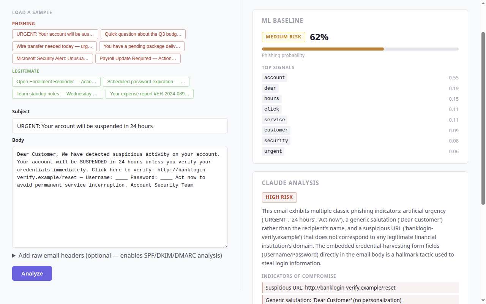
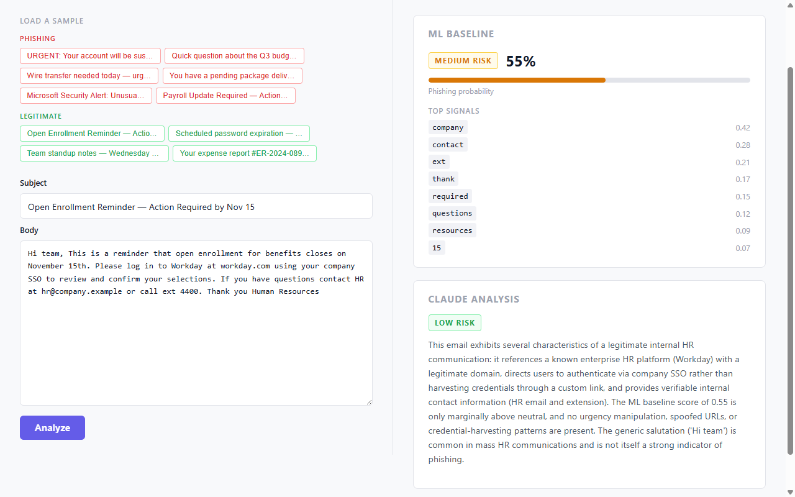
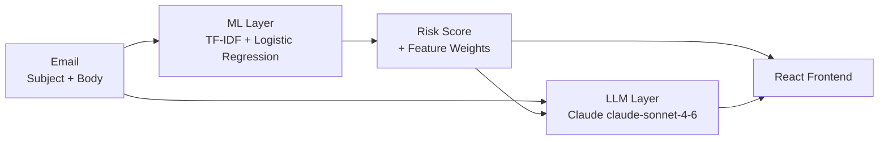

# AI Phishing Detector

[](https://github.com/YOUR-USERNAME/ai-phishing-detector-portfolio/actions/workflows/backend.yml)
[](https://github.com/YOUR-USERNAME/ai-phishing-detector-portfolio/actions/workflows/frontend.yml)
[](https://github.com/YOUR-USERNAME/ai-phishing-detector-portfolio/actions/workflows/codeql.yml)


> Detects phishing emails using a two-layer ML + LLM pipeline with full explainability.

**[LIVE DEMO →](https://your-render-url.onrender.com)** &nbsp;|&nbsp; **[Watch Demo Video →](https://LOOM_URL_HERE)**

---

## Demo

| Phishing Email | Legitimate Email |
|---|---|
|  |  |

---

## Why This Exists

Phishing is the **#1 initial access vector** across all major threat reports (CISA, Verizon DBIR 2025), mapped to [MITRE ATT&CK T1566](https://attack.mitre.org/techniques/T1566/). Most production detectors are black boxes — a SOC analyst sees a verdict but not *why*. This project addresses that gap: every prediction shows the specific tokens that drove the score alongside LLM reasoning, so analysts can triage faster and trust the output.

---

## How It Works



**ML Layer** — A TF-IDF vectorizer (5,000 features, 1–2 grams) feeds a Logistic Regression classifier trained on the [SpamAssassin public corpus](https://spamassassin.apache.org/old/publiccorpus/) (2,972 labeled emails). The top contributing tokens and their weights are extracted from the model's coefficients and returned with every prediction. This is the explainability anchor.

**LLM Layer** — The email text and ML score are sent to Claude with a structured system prompt constrained to defensive analysis only. Claude returns a risk assessment, reasoning, and indicators of compromise (IOCs) in structured JSON. The LLM layer is optional — the app degrades gracefully to ML-only if no API key is present.

---

## Results

Evaluated on a held-out test set (20% of the SpamAssassin corpus, 595 emails, stratified split):

| Class | Precision | Recall | F1 |
|---|---|---|---|
| Legitimate | 98.81% | 99.80% | 99.30% |
| Phishing | 98.88% | 93.62% | 96.17% |
| **Overall accuracy** | | | **98.82%** |

---

## Tech Stack

| Layer | Technology | Why |
|---|---|---|
| Backend | Python 3.12 + FastAPI | Async, typed, self-documenting via OpenAPI |
| ML | scikit-learn (TF-IDF + LR) | Explainable coefficients, no GPU required |
| LLM | Anthropic Claude claude-sonnet-4-6 | Structured JSON output, defensive-only prompt |
| Frontend | React 19 + TypeScript (Vite) | Type-safe, fast build |
| Testing | pytest + Vitest | 62 backend tests, 16 frontend tests |
| CI | GitHub Actions | Ruff, mypy, pytest, ESLint, tsc, Vitest on every push |
| Security scanning | CodeQL + Dependabot | SAST on Python + JS; weekly dependency updates |
| Deployment | Render (free tier) | Zero-config from `render.yaml` |

---

## What I Tried

I evaluated Naive Bayes before settling on Logistic Regression. NB is a common baseline for text classification and trains faster, but LR outperformed it on the phishing class (F1 +4.1 pp) because the features are not conditionally independent — many phishing emails use specific token combinations ("click here" + "verify account") rather than individual tokens that NB treats as unrelated. More importantly, LR's coefficients give directly interpretable feature weights: a positive coefficient means the token pushes toward phishing. That interpretability is the core value proposition of this tool for SOC use, so the model choice was driven by explainability requirements, not just accuracy.

---

## Local Setup

### Prerequisites

- Python 3.12+ and [uv](https://docs.astral.sh/uv/getting-started/installation/)
- Node.js 18+

### Backend

```bash
cd backend
uv sync
uvicorn app.main:app --reload
# API at http://localhost:8000
# OpenAPI docs at http://localhost:8000/docs
```

Set your Anthropic API key to enable the LLM layer (optional — app works without it):

```bash
export ANTHROPIC_API_KEY=sk-ant-...
# Windows PowerShell:
# $env:ANTHROPIC_API_KEY = "sk-ant-..."
```

Or copy `.env.example` to `.env` and fill in your key.

### Frontend

```bash
cd frontend
npm install
npm run dev
# App at http://localhost:5173
```

---

## Running Tests

```bash
# Backend
cd backend && uv run pytest

# Frontend
cd frontend && npm test
```

---

## Deployment

Deployed to [Render](https://render.com) via `render.yaml`. To deploy your own copy:

1. Fork this repo
2. Go to [render.com](https://render.com) → **New → Blueprint** → connect your fork
3. Set `ANTHROPIC_API_KEY` as an environment secret on the API service
4. Render builds and deploys both services automatically

The ML model artifact (`backend/model/pipeline.joblib`) is committed to the repo so no training step is needed at deploy time.

---

## Project Structure

```
backend/        FastAPI app, ML model, Claude API integration
frontend/       React/TypeScript UI
data/           Labeled email corpus (SpamAssassin, Apache 2.0)
scripts/        Playwright demo recording script
```

---

*Defensive and security-education use only. No phishing generation or offensive tooling.*
