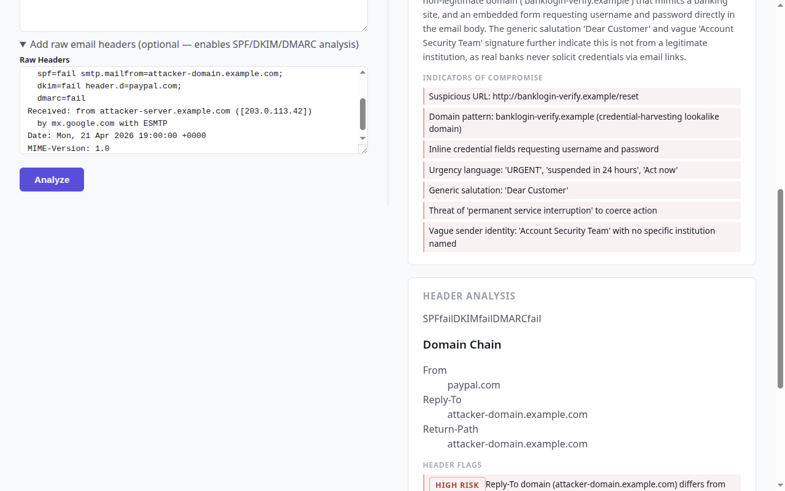
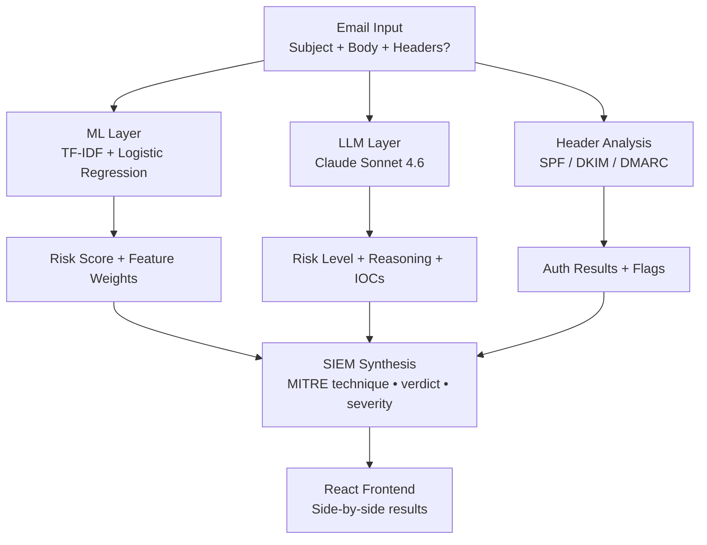

# AI Phishing Detector

[](https://github.com/Rblea97/ai-phishing-detector-portfolio/actions/workflows/backend.yml)
[](https://github.com/Rblea97/ai-phishing-detector-portfolio/actions/workflows/frontend.yml)
[](https://github.com/Rblea97/ai-phishing-detector-portfolio/actions/workflows/codeql.yml)


> A blue team email triage tool that detects phishing attempts, extracts Indicators of Compromise (IOCs), and explains *why* — built for SOC analyst workflows. Combines a 98.82%-accurate ML classifier with Claude-powered threat reasoning and structured SIEM output.

**[LIVE DEMO →](https://phishing-detector-ui-s3bf.onrender.com)** &nbsp;|&nbsp; **[Watch Demo Video →](https://youtu.be/wYcv8Ve5-Sw)** &nbsp;|&nbsp; **[OpenAPI Docs →](https://phishing-detector-api.onrender.com/docs)**

> **Role relevance:** Designed around the SOC Tier 1 analyst workflow — alert received → email triaged → IOCs extracted → severity scored → escalation decision supported.

---

## Demo

| Phishing Email | Legitimate Email |
|---|---|
|  |  |

| Header Analysis (SPF/DKIM/DMARC + domain chain) |
|---|
|  |

---

## Why This Exists

Phishing is the **#1 initial access vector** across all major threat reports (CISA, Verizon DBIR 2025), mapped to [MITRE ATT&CK T1566](https://attack.mitre.org/techniques/T1566/). Most production detectors are black boxes — a SOC analyst sees a verdict but not *why*.

This project addresses that gap: every prediction shows the specific tokens that drove the ML score alongside LLM reasoning, so analysts can triage faster and trust the output. The architecture treats **ML as the explainable floor** (which tokens triggered the verdict?) and **LLM as the reasoning ceiling** (why do those tokens matter here?). Neither is load-bearing alone.

---

## Blue Team Concepts Demonstrated

| Concept | Implementation |
|---|---|
| Threat Detection | ML classifier flags phishing with 96.17% F1 on the attack class |
| IOC Extraction | LLM layer extracts malicious URLs, urgency language, impersonation patterns |
| Anomaly Detection | TF-IDF feature weights surface statistically unusual token patterns |
| Alert Triage Support | Confidence scores + top-N suspicious tokens enable rapid analyst decisions |
| False Positive Management | 99.80% legitimate-class recall → ~0.20% FPR, minimizing analyst alert fatigue |
| MITRE ATT&CK Mapping | Detections tagged to [T1566.002](https://attack.mitre.org/techniques/T1566/002/) (Spearphishing Link), [T1566](https://attack.mitre.org/techniques/T1566/) (generic Phishing), and adjacent techniques |
| Explainability (XAI) | Every verdict shows the specific tokens driving the score — no black box |
| SIEM Integration | Every verdict emits a structured `SiemLogEntry` (verdict, severity, MITRE technique, IOCs) designed for Splunk / Elastic SIEM / Azure Sentinel ingest |
| Email Authentication | Header analysis layer parses SPF/DKIM/DMARC results and flags domain-chain anomalies |
| Header IOC Detection | Detects Reply-To mismatch, Return-Path mismatch, and authentication failures |

---

## How It Works



**ML Layer** — TF-IDF (5,000 features, 1–2 grams, sublinear TF) feeds a Logistic Regression classifier trained on the [SpamAssassin public corpus](https://spamassassin.apache.org/old/publiccorpus/) (80,000 emails). Top contributing tokens extracted from LR coefficients × TF-IDF weights give an analyst a specific, auditable reason for each verdict.

**LLM Layer** — Email text and ML score are sent to Claude with a system prompt constrained to defensive analysis only. Returns `risk_level`, `reasoning` (2–3 sentences), and structured `iocs`. Optional — degrades gracefully to ML-only if `ANTHROPIC_API_KEY` is absent.

**Header Analysis** — Raw email headers parsed for SPF/DKIM/DMARC results, domain chain (From / Reply-To / Return-Path), and five flag types (SPF fail, DKIM fail, DMARC fail, Reply-To mismatch, Return-Path mismatch). Optional — omit headers to skip.

**SIEM Synthesis** — Aggregates all layers into a single structured event record with a MITRE ATT&CK technique ID, deduplicated IOC list, and analyst notes ready for Splunk / Elastic / Sentinel ingest.

See [docs/ARCHITECTURE.md](docs/ARCHITECTURE.md) for component deep-dives, concurrency model, and graceful degradation matrix.

---

## MITRE ATT&CK Coverage

| Technique | Name | Detection Signal | Coverage |
|---|---|---|---|
| [T1566](https://attack.mitre.org/techniques/T1566/) | Phishing | Primary verdict — all phishing verdicts | ✅ Detected |
| [T1566.002](https://attack.mitre.org/techniques/T1566/002/) | Spearphishing Link | URL in LLM-extracted IOC list | ✅ Detected |
| [T1566.001](https://attack.mitre.org/techniques/T1566/001/) | Spearphishing Attachment | File attachment analysis (text-only detector) | ⚠️ Gap — see MODEL_CARD |
| [T1566.003](https://attack.mitre.org/techniques/T1566/003/) | Spearphishing via Service | Third-party service delivery context | ⚠️ Partial — body text only |
| [T1598.003](https://attack.mitre.org/techniques/T1598/003/) | Phishing for Information: Link | Credential-solicitation lexicon in TF-IDF features | ✅ Detected |
| [T1036](https://attack.mitre.org/techniques/T1036/) | Masquerading | Reply-To domain mismatch header flag | ✅ Detected |
| [T1656](https://attack.mitre.org/techniques/T1656/) | Impersonation | Executive / brand impersonation patterns (LLM + ML) | ✅ Detected |
| [T1204.001](https://attack.mitre.org/techniques/T1204/001/) | User Execution: Malicious Link | Referenced — downstream of T1566.002 delivery | 📖 Reference |

**ATT&CK Navigator layer:** [`docs/attack-navigator-layer.json`](docs/attack-navigator-layer.json) — load at [mitre-attack.github.io/attack-navigator](https://mitre-attack.github.io/attack-navigator/) to visualise coverage.

---

## MITRE D3FEND Defensive Techniques

This project implements the following [MITRE D3FEND](https://d3fend.mitre.org/) defensive techniques:

| D3FEND ID | Technique | Implementation |
|---|---|---|
| [D3-MHA](https://d3fend.mitre.org/technique/d3f:MessageHeaderAnalysis/) | Message Header Analysis | `app/headers.py` — SPF/DKIM/DMARC parsing and domain-chain anomaly detection |
| [D3-MA](https://d3fend.mitre.org/technique/d3f:MessageAnalysis/) | Message Analysis | `app/ml.py` — TF-IDF feature analysis of email subject + body |
| [D3-SRA](https://d3fend.mitre.org/technique/d3f:SenderReputationAnalysis/) | Sender Reputation Analysis | Header flags: SPF fail, DKIM fail, From/Reply-To domain mismatch |
| [D3-UA](https://d3fend.mitre.org/technique/d3f:URLAnalysis/) | URL Analysis | LLM layer extracts and evaluates URLs in IOC list; SIEM assigns T1566.002 when URL IOC present |

---

## Results

Evaluated on a held-out test set (20% of the SpamAssassin corpus, 595 emails, stratified split):

| Class | Precision | Recall | F1 |
|---|---|---|---|
| Legitimate | 98.81% | 99.80% | 99.30% |
| Phishing | 98.88% | 93.62% | 96.17% |
| **Overall accuracy** | | | **98.82%** |
| **False Positive Rate** | | | **~0.20%** |

> A ~0.20% FPR means roughly 1 in 500 legitimate emails is incorrectly flagged — minimizing false alarms is a first-class design goal for SOC tooling.

<details>
<summary>Example SIEM log output (URL-bearing phishing email)</summary>

```json
{
  "timestamp": "2026-04-21T20:00:00Z",
  "event_type": "email_threat_assessment",
  "verdict": "PHISHING",
  "severity": "HIGH",
  "confidence": 0.97,
  "mitre_technique": "T1566.002",
  "iocs": ["http://banklogin-verify.example/reset", "urgency language: account suspended"],
  "header_flags": ["spf_fail", "reply_to_mismatch"],
  "analyst_notes": "Email exhibits classic credential-harvesting pattern with spoofed banking domain..."
}
```

*Note: `mitre_technique` is `T1566.002` (Spearphishing Link) when the LLM IOC list contains a URL; falls back to `T1566` for BEC-style phishing with no URL payload.*

</details>

---

## Tech Stack

| Layer | Technology | Why |
|---|---|---|
| Backend | Python 3.12 + FastAPI | Async, typed, self-documenting via OpenAPI |
| ML | scikit-learn (TF-IDF + LR) | Explainable coefficients, no GPU required |
| LLM | Anthropic Claude Sonnet 4.6 | Structured JSON output, defensive-only prompt |
| Frontend | React 19 + TypeScript (Vite) | Type-safe, fast build |
| Testing | pytest + Vitest | 126 backend tests, 16 frontend tests, 98% coverage |
| CI | GitHub Actions | Ruff, mypy, pytest, ESLint, tsc, Vitest on every push |
| Security scanning | CodeQL + Dependabot | SAST on Python + JS; weekly dependency updates |
| Deployment | Render (free tier) | Zero-config from `render.yaml` |

---

## Model Selection: Explainability Over Black-Box Accuracy

In SOC environments, a black-box model creates analyst distrust even when accurate — an analyst needs to explain a verdict to a stakeholder, not just report a score. I evaluated Naive Bayes before settling on Logistic Regression for two reasons:

1. **Performance:** LR outperformed NB on the phishing class by **+4.1 F1 pp** because phishing relies on token *combinations* ("click here" + "verify account" together), not individual tokens treated as conditionally independent as NB assumes.

2. **Auditability:** LR's coefficients give directly interpretable feature weights. A positive coefficient × TF-IDF weight = the token pushed toward phishing, by that amount, for this specific email. This per-prediction explanation is the core value proposition for SOC tooling.

BERT/transformer models were evaluated conceptually but excluded: higher accuracy ceiling, but inherently less interpretable embeddings, GPU infrastructure requirement, and 100× inference latency — all poor trade-offs when explainability is the design goal. See [docs/MODEL_CARD.md](docs/MODEL_CARD.md) for the full comparison.

---

## Threat Model

| Threat | Mitigation |
|---|---|
| Generating phishing content | Not possible — system prompt instructs Claude to perform analysis only. No generation endpoint exists. |
| Real credential harvesting | Demo samples are synthetic, using IANA-reserved `.example` domains that will never resolve. |
| PII in training data | Only publicly licensed research datasets used (SpamAssassin, Apache 2.0). All synthetic rows clearly labeled. |
| Prompt injection via email body | System prompt frames email as artifact under analysis, not as instructions. JSON-only output constraint limits blast radius. |
| API key exposure | `ANTHROPIC_API_KEY` is server-side only, set as environment variable. Never returned to frontend or logged. |
| Misuse as offensive tool | No phishing-generation endpoints, no bulk-analysis API, no authentication bypass path. |

---

## Known Limitations

1. **Text-only:** Image-based phishing, QR code phishing ("quishing"), and file-attachment delivery (T1566.001) are invisible to the classifier. The detector sees only subject + body text.

2. **LLM-generated phishing text:** Generative AI produces grammatically flawless phishing that defeats traditional grammar/spelling heuristics. An adversary using Claude or GPT-4 to craft phishing text will see reduced ML detection rates.

3. **Corpus age:** SpamAssassin training data dates from 2002–2005. Modern brand impersonation (Microsoft, Docusign, USPS) may be under-represented.

4. **No adversarial hardening:** The model was not trained against deliberate evasion (token obfuscation, synonym substitution, homoglyph attacks).

5. **Static model:** Retraining is a manual script. The model does not adapt to analyst feedback or new campaigns without full retraining.

See [docs/MODEL_CARD.md](docs/MODEL_CARD.md) for the full limitations discussion, including fairness notes and environmental impact.

---

## What I'd Build Next

1. **Adversarial robustness testing** — Generate perturbed phishing samples (token obfuscation, synonym replacement) and measure detection degradation. Prioritize hardening against known evasion patterns.

2. **Model retraining pipeline** — Replace manual `train_model.py` with a CI-triggered pipeline that retrains on new labeled data and compares F1 against the committed baseline before promoting the artifact.

3. **Sigma rule export** — Generate a [Sigma](https://github.com/SigmaHQ/sigma) detection rule from the model's top-weighted tokens so the ML-learned patterns can be deployed directly to any SIEM without the ML infrastructure.

4. **BERT/DistilBERT comparison** — Add a second model path (behind a feature flag) to directly measure the accuracy/explainability trade-off for hiring-manager audiences who ask about transformer alternatives.

5. **IMAP/webhook ingest** — Connect to a real email inbox (OAuth 2.0) so the tool operates on live mail rather than pasted text. This moves from demo to production-adjacent.

6. **Analyst feedback loop** — Capture analyst override decisions (false positive / false negative) to build a continuous learning dataset for future retraining.

---

## Interview Q&A

Common questions from technical interviews for security ML and detection engineering roles:

<details>
<summary>Why Logistic Regression over Naive Bayes or BERT?</summary>

**Naive Bayes:** LR outperformed NB by +4.1 F1 percentage points on the phishing class. NB's conditional-independence assumption breaks down for phishing, where specific token *combinations* are the signal. More importantly, NB gives class probabilities that are less reliable for threshold-tuning than LR's calibrated probabilities.

**BERT/transformers:** Higher theoretical accuracy but: (1) embeddings are harder to explain to an analyst than a token-weight list; (2) inference latency is ~100×; (3) GPU infrastructure is required; (4) the explainability gap is the main design problem, not raw accuracy. Logistic Regression was chosen because the core deliverable for this tool is an explanation, not just a verdict.

</details>

<details>
<summary>How would you scale this to 1 million emails per day?</summary>

At ~1ms ML inference and ~800ms LLM latency, 1M emails/day = ~11.6 emails/second. The ML layer handles this on a single CPU. The bottleneck is the LLM call.

**Scaling path:**
1. **Async queuing:** Move LLM calls off the request path into a Celery/SQS task queue. Return the ML verdict immediately; deliver the LLM result via WebSocket or polling.
2. **Tiered analysis:** Only run LLM on emails where ML score is in the uncertain range (0.4–0.75). Clear high/low verdicts skip the LLM entirely.
3. **Batch LLM:** Use the Anthropic Batch API for queued emails — lower cost, higher throughput.
4. **Horizontal ML scaling:** ML is stateless; deploy behind a load balancer with multiple workers.
5. **Model upgrade:** At true scale, a fine-tuned DistilBERT model batched on GPU would outperform TF-IDF+LR. The explainability trade-off becomes acceptable when LLM reasoning is always present.

</details>

<details>
<summary>What are your model's known limitations?</summary>

1. The model is text-only — attachment-based phishing (T1566.001), image-based phishing, and QR code delivery are invisible.
2. LLM-generated phishing text is grammatically flawless, defeating any grammar/spelling heuristics the model may have learned.
3. The training corpus (SpamAssassin) dates from 2002–2005, predating many modern brand impersonation patterns.
4. No adversarial hardening — token obfuscation, homoglyph substitution, and synonym replacement can evade detection.
5. The model doesn't learn from analyst feedback without full retraining.

In a production context, this tool would be one layer in a defence-in-depth stack (SEG → ML classifier → LLM reasoning → SIEM correlation → analyst review), not a standalone gate.

</details>

<details>
<summary>How does the LLM layer handle prompt injection?</summary>

Two controls:
1. **System prompt framing:** The system prompt explicitly frames the email as an *artifact under analysis* ("assess whether the email below is a phishing attempt"), not as executable instructions. This contextual framing reduces the probability that an adversarial email convinces Claude to act on its instructions.
2. **JSON-only output constraint:** Claude is instructed to respond only with a specific JSON object with three defined keys. If a prompt injection payload tries to exfiltrate data or generate harmful content, it would have to fit within the `reasoning` and `iocs` string fields, which the frontend renders as plain text — not as HTML, JavaScript, or API calls. The blast radius is limited to text displayed in the UI.

This is not a complete defence — a sufficiently adversarial payload could still manipulate the `risk_level` or `reasoning` fields — but it significantly raises the bar compared to an unconstrained prompt.

</details>

<details>
<summary>What's your false positive rate and why does it matter for SOC?</summary>

The model achieves ~0.20% FPR (99.80% recall on the legitimate class). In a SOC context with 100 emails/day, that's roughly 1 false-positive alert per week.

Why it matters: **false positives are not free.** Each one takes analyst time to review and dismiss, contributes to alert fatigue, and erodes trust in the detection system. A model with 99.5% accuracy but 5% FPR would generate 5 false alarms per 100 emails — potentially more analyst burden than the system saves. This is why I optimized for legitimate-class recall (`class_weight="balanced"` in LR) even though that slightly reduces phishing recall.

The trade-off is explicit: a ~6% phishing miss rate (phishing recall 93.62%) means some phishing gets through to the analyst queue undetected. In a layered architecture, those misses are caught downstream by the LLM layer, header analysis, or the analyst reviewing borderline cases.

</details>

<details>
<summary>How does the SIEM integration work and what schema did you follow?</summary>

Every `POST /api/analyze` response includes a `SiemLogEntry` object. Fields:

- `timestamp` — ISO-8601 UTC (compatible with Splunk time parsing)
- `event_type` — `"email_threat_assessment"` (constant, enables SIEM filtering)
- `verdict` — `PHISHING | LEGITIMATE | UNCERTAIN`
- `severity` — `HIGH | MEDIUM | LOW` (from ML risk_level)
- `confidence` — ML probability score (0.0–1.0)
- `mitre_technique` — Most specific applicable ATT&CK technique ID (`T1566.002` for URL-bearing phishing, `T1566` for generic/BEC)
- `iocs` — Deduplicated list of IOC strings from the LLM layer
- `header_flags` — List of header flag names (e.g., `spf_fail`, `reply_to_mismatch`)
- `analyst_notes` — LLM reasoning paragraph (empty string if LLM unavailable)

Field naming follows Splunk CIM conventions. For Elastic Common Schema (ECS) ingest, map: `mitre_technique` → `threat.technique.id`, `verdict` → `event.outcome`, `confidence` → `event.risk_score`.

</details>

<details>
<summary>What security controls protect the API key?</summary>

1. `ANTHROPIC_API_KEY` is loaded from the environment at request time (`os.environ.get`), never at module import. This prevents it appearing in stack traces from module initialisation errors.
2. It is never returned in any API response — the frontend has no way to access it.
3. It is never logged (the `logger.debug` and `logger.exception` calls in `llm.py` log only status strings, not request parameters).
4. `.env.example` documents that a `.env` file should be used locally; `.gitignore` excludes `.env` from commits.
5. GitHub Secrets stores the key for CI if needed; Render Dashboard stores it for production — neither exposes it in environment variables visible to the frontend build.

CodeQL SAST scans every commit for hardcoded secrets and credential patterns.

</details>

<details>
<summary>How would you improve the model's detection of modern phishing?</summary>

Three high-impact directions:

1. **Recent training data:** Supplement SpamAssassin (2002–2005) with modern phishing datasets — PhishTank export, OpenPhish feed snapshots, or the IWSPA-AP 2018 dataset. The current corpus under-represents brand impersonation of Microsoft, DocuSign, and USPS.

2. **Header features in the ML model:** Currently, SPF/DKIM/DMARC signals are in a separate header analysis layer. Adding them as binary features to the TF-IDF matrix would let LR learn correlations (e.g., SPF fail + credential-harvest lexicon = high phishing probability).

3. **Active learning:** Deploy the current model, collect analyst feedback on borderline cases, use those feedback labels to retrain. This closes the loop between the model and the adversarial examples that reach the uncertain zone.

For adversarial robustness specifically: generate perturbed phishing samples (TextFooler, BERT-Attack) and retrain with augmentation. Measure AUC degradation under attack as a metric.

</details>

---

## Local Setup

### Prerequisites

- Python 3.12+ and [uv](https://docs.astral.sh/uv/getting-started/installation/)
- Node.js 18+

### Backend

```bash
cd backend
uv sync
uvicorn app.main:app --reload
# API at http://localhost:8000
# OpenAPI docs at http://localhost:8000/docs
```

Set your Anthropic API key to enable the LLM layer (optional — app works without it):

```bash
export ANTHROPIC_API_KEY=sk-ant-...
# Windows PowerShell:
# $env:ANTHROPIC_API_KEY = "sk-ant-..."
```

Or copy `.env.example` to `.env` and fill in your key.

### Frontend

```bash
cd frontend
npm install
npm run dev
# App at http://localhost:5173
```

---

## Running Tests

```bash
# Backend (126 tests, 98% coverage)
cd backend && uv run pytest

# Frontend (16 tests)
cd frontend && npm test
```

---

## Deployment

Deployed to [Render](https://render.com) via `render.yaml`. To deploy your own copy:

1. Fork this repo
2. Go to [render.com](https://render.com) → **New → Blueprint** → connect your fork
3. Set `ANTHROPIC_API_KEY` as an environment secret on the API service
4. Render builds and deploys both services automatically

The ML model artifact (`backend/model/pipeline.joblib`) is committed to the repo — no training step needed at deploy time.

---

## Project Structure

```
backend/        FastAPI app (4 analysis layers: ML, LLM, Headers, SIEM)
  app/ml.py       TF-IDF + Logistic Regression inference
  app/llm.py      Claude API integration
  app/headers.py  Email header parsing (SPF/DKIM/DMARC)
  app/siem.py     SIEM log synthesis with MITRE ATT&CK mapping
  tests/          126 pytest tests, 98% coverage
frontend/       React 19 + TypeScript (Vite)
  src/components/ MLResultCard, LLMResultCard, HeaderAnalysisCard
data/           Labeled email corpus (SpamAssassin, Apache 2.0)
docs/           Architecture, model card, ATT&CK Navigator layer, screenshots
  ARCHITECTURE.md   System design and component deep-dives
  MODEL_CARD.md     Training data, evaluation, and known limitations
  attack-navigator-layer.json  MITRE ATT&CK coverage map
```

---

## Further Reading

- [Architecture deep-dive](docs/ARCHITECTURE.md) — concurrency model, component breakdown, data flow
- [Model card](docs/MODEL_CARD.md) — training data, evaluation metrics, known limitations, fairness notes
- [ATT&CK Navigator layer](docs/attack-navigator-layer.json) — visualise technique coverage
- [Product & engineering spec](docs/spec.md) — original V1 requirements

---

*Defensive and security-education use only. No phishing generation or offensive tooling.*
