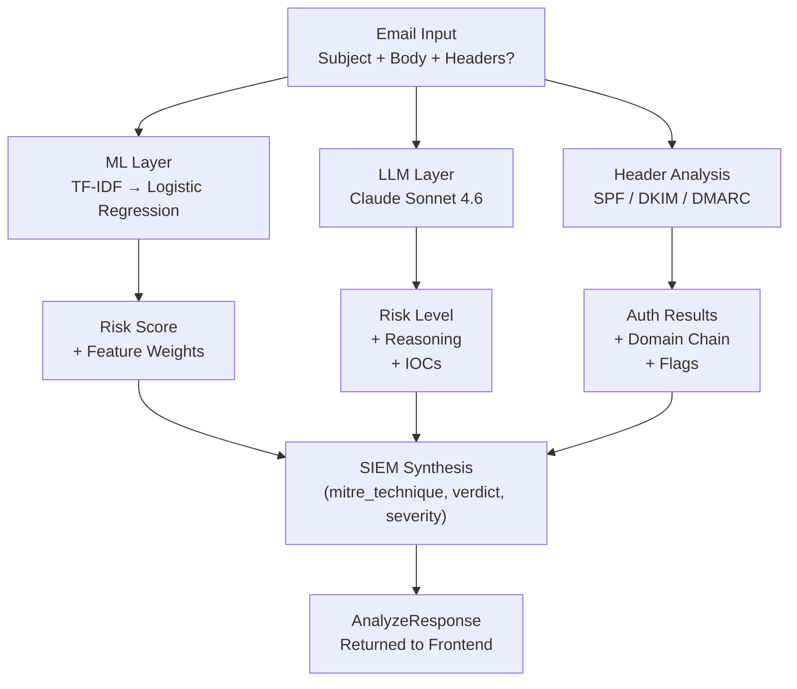

# Architecture — AI Phishing Detector

## System Overview

The AI Phishing Detector is a four-layer, parallel-analysis pipeline that combines classical machine learning, LLM reasoning, email protocol authentication, and structured SIEM output into a single API response. Each layer is independently optional and the system degrades gracefully when any layer is unavailable.



**Data flow for POST /api/analyze:**

1. Request arrives at FastAPI with `{subject, body, headers?}`
2. ML inference runs first (~1ms, synchronous in `asyncio.to_thread`) — its score feeds the LLM prompt
3. LLM call and header parsing run in parallel with the ML result already available
4. SIEM synthesis aggregates all three outputs into a single structured log entry
5. `AnalyzeResponse` bundles all results and returns HTTP 200

---

## Component Breakdown

### 1. ML Layer (`app/ml.py`)

**Purpose:** Produce an explainable phishing probability score from the email's text features.

**Pipeline:**

```
email text (subject + "\n\n" + body)
    ↓
TfidfVectorizer
    max_features=5000
    ngram_range=(1, 2)     ← unigrams + bigrams capture "click here", "verify account"
    sublinear_tf=True       ← dampens term-frequency dominance
    stop_words="english"    ← removes noise words
    ↓
Sparse feature matrix (1 × 5000)
    ↓
LogisticRegression
    C=1.0                   ← regularisation strength
    class_weight="balanced" ← corrects for imbalanced training distribution
    max_iter=1000
    random_state=42
    ↓
MLResult { score: float, risk_level: str, top_features: [{ token, weight }] }
```

**Explainability mechanism:** The top N contributing tokens are extracted by multiplying the TF-IDF weight of each token in the input by its LR coefficient. A positive product means the token pushes toward phishing. This gives an analyst a specific, auditable reason for each verdict.

**Risk bucketing:**

| Score range | Risk level | Design note |
|---|---|---|
| ≥ 0.75 | high | Conservative high threshold reduces false-high noise |
| 0.40 – 0.74 | medium | Covers statistically ambiguous emails |
| < 0.40 | low | Matches SIEM "LEGITIMATE" verdict at score < 0.4 |

**Model choice rationale:** Logistic Regression was chosen over Naive Bayes for two reasons: (1) LR outperformed NB on the phishing class by +4.1 F1 percentage points because phishing relies on token *combinations* (e.g., "click" + "verify" together), not tokens treated as conditionally independent as NB assumes; (2) LR coefficients provide directly interpretable feature weights that allow analysts to audit and explain verdicts — a first-class requirement for SOC tooling. BERT/transformer models were out of scope because they are inherently less interpretable and add significant infrastructure complexity without addressing the core portfolio signal.

**Concurrency:** `asyncio.to_thread` is used because scikit-learn is not async-aware and the GIL prevents true parallelism for CPU-bound work within a single thread. Offloading to a thread pool prevents the ML call from blocking the event loop.

**Model artifact:** The trained pipeline is serialized to `model/pipeline.joblib` and committed to the repository so deployment requires no training step. `@functools.lru_cache(maxsize=1)` caches the loaded pipeline for the lifetime of the process.

---

### 2. LLM Layer (`app/llm.py`)

**Purpose:** Augment the ML score with contextual reasoning and structured IOC extraction using Claude.

**Prompt design:**

```
System:
    "You are a defensive cybersecurity analyst specialising in phishing detection.
    Your task is to assess whether the email below is a phishing attempt and explain your reasoning.
    RULES:
    - Respond ONLY with a single valid JSON object — no prose, no markdown fences.
    - JSON must have exactly these keys:
        risk_level  : one of "high", "medium", or "low"
        reasoning   : 2-3 sentences explaining the risk assessment
        iocs        : array of strings listing observed indicators of compromise
    - Do NOT generate phishing content, attack code, or offensive material."

User:
    "ML baseline phishing probability: {score:.2f}
    Subject: {subject}
    Body: {body}"
```

**Why the ML score is in the prompt:** The LLM receives the ML baseline score so it can calibrate its reasoning against a quantitative signal. If the ML score is 0.97 but the email looks innocuous, the LLM is nudged to look harder. This cross-validation is the core value of the dual-layer architecture.

**Graceful degradation:** `ANTHROPIC_API_KEY` is loaded from the environment at call time. If absent or if any API error occurs, `analyze()` returns `None`. The FastAPI route handles `None` gracefully — `llm: null` in the response body, HTTP 200 always returned.

**Prompt injection defence:** The system prompt frames the email as an *artifact under analysis*, not as instructions. The JSON-only output constraint limits the blast radius of any adversarial email content — Claude is constrained to emit only the three defined fields.

**Output parsing:** `parse_llm_response()` strips optional markdown code fences (``` ```json ... ``` ```) that Claude occasionally adds despite being instructed not to, then validates the cleaned JSON against the `LLMResult` Pydantic schema.

---

### 3. Header Analysis Layer (`app/headers.py`)

**Purpose:** Extract email authentication metadata and flag domain-chain anomalies that are common in phishing.

**Signals extracted:**

| Header | Signal | ATT&CK relevance |
|---|---|---|
| `From` | Sender domain | Baseline for domain-chain comparison |
| `Reply-To` | Reply-To domain | Mismatch → T1566 (redirection to attacker mailbox) |
| `Return-Path` | Bounce path domain | Mismatch → bounce path harvesting |
| `Authentication-Results` | SPF / DKIM / DMARC results | Auth failure → T1566, T1036 (masquerading) |

**Flag detection logic:**

```
reply_to_mismatch  → Reply-To domain ≠ From domain          (HIGH)
return_path_mismatch → Return-Path domain ≠ From domain      (MEDIUM)
spf_fail           → SPF=fail or SPF=softfail                (HIGH)
dkim_fail          → DKIM=fail                               (HIGH)
dmarc_fail         → DMARC=fail                              (HIGH)
```

**RFC compliance:** `extract_domain()` uses Python's `email.utils.parseaddr()` to handle both `user@domain.com` and `Display Name <user@domain.com>` formats. `parse_auth_result()` uses a negative-lookbehind regex to distinguish `spf=` from `adkim=` when both appear in the same `Authentication-Results` header.

**Optionality:** Headers are submitted as an optional plain-text field. `parse_headers()` returns `None` for empty/absent input. The API route propagates `null` in the response. No functionality is broken when headers are absent.

---

### 4. SIEM Synthesis Layer (`app/siem.py`)

**Purpose:** Aggregate all analysis outputs into a single structured event record consumable by SIEM platforms (Splunk, Elastic SIEM, Azure Sentinel).

**Verdict logic:**

| ML score | Verdict |
|---|---|
| ≥ 0.5 | PHISHING |
| 0.4 – 0.49 | UNCERTAIN |
| < 0.4 | LEGITIMATE |

**MITRE ATT&CK technique assignment:**

The technique is assigned at the most specific applicable level:

| Condition | Technique | Name |
|---|---|---|
| Verdict = PHISHING and URL found in LLM IOCs | T1566.002 | Spearphishing Link |
| Verdict = PHISHING, no URL IOC (e.g., BEC) | T1566 | Phishing (generic) |
| Verdict ≠ PHISHING | T1566 | Phishing (reference technique) |

T1566.001 (Spearphishing Attachment) is not assigned because the detector is text-only and does not analyse file attachments — claiming attachment detection would be inaccurate. See [docs/MODEL_CARD.md](MODEL_CARD.md) for known limitations.

**IOC deduplication:** `dict.fromkeys(llm.iocs)` removes duplicates while preserving insertion order (Python 3.7+ dict guarantee).

**Output schema (`SiemLogEntry`):**

```json
{
  "timestamp":       "2026-04-21T20:00:00Z",         // ISO-8601 UTC
  "event_type":      "email_threat_assessment",
  "verdict":         "PHISHING",                      // PHISHING | LEGITIMATE | UNCERTAIN
  "severity":        "HIGH",                          // HIGH | MEDIUM | LOW
  "confidence":      0.97,                            // ML score (0.0–1.0)
  "mitre_technique": "T1566.002",                     // Most specific applicable technique
  "iocs":            ["http://evil.example/login"],   // Deduplicated LLM-extracted IOCs
  "header_flags":    ["spf_fail", "reply_to_mismatch"],  // Flag names from header analysis
  "analyst_notes":   "Email exhibits..."              // LLM reasoning (empty if LLM unavailable)
}
```

**SIEM platform mapping:** Field names follow Splunk Common Information Model (CIM) conventions where possible. For Elastic Common Schema (ECS) consumers, map `mitre_technique` → `threat.technique.id` and `verdict` → `event.outcome`.

---

## Concurrency Model

```
POST /api/analyze
    │
    ├── asyncio.to_thread(ml_analyze)    ← ~1ms, runs first (score feeds LLM prompt)
    │
    ├── asyncio.to_thread(llm_analyze)   ← ~800ms (API call)
    │
    └── parse_headers(request.headers)   ← sync, ~0ms
    │
    └── build_siem_log(ml, llm, headers) ← sync, aggregation only
```

ML inference completes first because its output feeds the LLM prompt. The LLM call and header parsing run after ML, with header parsing being effectively instantaneous. `asyncio.to_thread` is used rather than `asyncio.gather` across all three because the ML-first ordering is intentional — the LLM needs the ML score before starting.

---

## Graceful Degradation Matrix

| Condition | ML result | LLM result | Header result | SIEM result |
|---|---|---|---|---|
| Normal operation (API key set, headers submitted) | ✅ | ✅ | ✅ | ✅ full |
| No API key | ✅ | null | ✅ | ✅ (no IOCs, no notes) |
| No headers submitted | ✅ | ✅ | null | ✅ (no header_flags) |
| API key set, Claude API error | ✅ | null | ✅ | ✅ (no IOCs, no notes) |
| No API key, no headers | ✅ | null | null | ✅ (minimal) |

The system never returns HTTP 500 due to an optional layer being absent. Only a failure in the ML layer (model not loaded) would cause a startup failure — the lifespan hook loads and caches the pipeline at startup so this fails fast before any requests are served.

---

## Data Flow: Training vs. Inference

```
Training (offline, scripts/train_model.py):
    data/emails.csv (80k rows)
        ↓ filter label ∈ {phishing, legitimate}
    train/test split (80/20, stratified, random_state=42)
        ↓
    TfidfVectorizer.fit_transform(X_train)
        ↓
    LogisticRegression.fit(X_train_tfidf, y_train)
        ↓
    joblib.dump(pipeline, "model/pipeline.joblib")

Inference (online, app/ml.py):
    pipeline.joblib (loaded once at startup, LRU-cached)
        ↓
    pipeline.predict_proba([email_text])[0][1]   ← phishing class probability
        ↓
    tfidf.transform([text]) × clf.coef_[0]       ← feature contributions
```

The model artifact is committed to the repository so no training environment is required at deploy time. This is intentional for a demo — production systems would use a model registry with versioning (MLflow, W&B, SageMaker Model Registry).

---

## Security Design Decisions

| Decision | Rationale |
|---|---|
| API key loaded at request time, not at import | Enables hot-swapping the key without restart; key never appears in stack traces from module init |
| System prompt frames email as artifact, not instructions | Defence-in-depth against prompt injection from adversarial email content |
| JSON-only output constraint | Limits the blast radius of any prompt injection — Claude can only emit structured fields |
| No email persistence | Emails are analysed in memory and discarded; no database, no PII retention |
| IANA-reserved `.example` domains in demo data | Demo emails will never resolve to real servers; no accidental phishing simulation |
| `class_weight="balanced"` in LogisticRegression | Prevents the majority-class (legitimate) dominating training and inflating accuracy at the cost of phishing recall |

---

## Directory Structure

```
backend/
├── app/
│   ├── main.py         # FastAPI routes and CORS config
│   ├── schemas.py      # Pydantic request/response contracts
│   ├── ml.py           # TF-IDF + LR inference
│   ├── llm.py          # Claude API integration
│   ├── headers.py      # Email header parsing and flag detection
│   ├── siem.py         # SIEM log synthesis and ATT&CK mapping
│   ├── samples.py      # Demo email loader
│   └── dataset.py      # CSV dataset loader
├── data/
│   ├── emails.csv      # 80k training corpus (SpamAssassin, Apache 2.0)
│   └── demo_emails.csv # 12 hand-crafted demo samples
├── model/
│   └── pipeline.joblib # Serialized TF-IDF + LR pipeline (committed)
├── scripts/
│   ├── train_model.py  # One-time training script
│   └── download_data.py# SpamAssassin corpus downloader
└── tests/              # 124 pytest tests, 98% coverage

frontend/
├── src/
│   ├── App.tsx                    # Main component, form + results layout
│   ├── types.ts                   # TypeScript interfaces (mirrors Pydantic schemas)
│   ├── api/client.ts              # Fetch wrapper for backend API
│   └── components/
│       ├── MLResultCard.tsx       # Score bar + top feature tokens
│       ├── LLMResultCard.tsx      # Risk badge + reasoning + IOC list
│       ├── HeaderAnalysisCard.tsx # SPF/DKIM/DMARC badges + domain chain
│       └── RiskBadge.tsx          # Reusable risk level indicator
└── ...

docs/
├── ARCHITECTURE.md     # This file
├── MODEL_CARD.md       # ML model documentation and known limitations
├── spec.md             # V1 product & engineering specification
├── resume-bullets.md   # Tailored resume talking points by role
└── screenshots/        # UI screenshots for README
```
