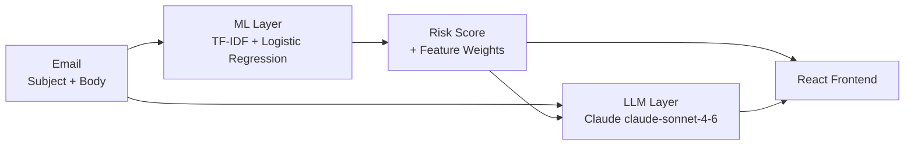

# Portfolio Readiness Implementation Plan

> **For agentic workers:** REQUIRED SUB-SKILL: Use superpowers:subagent-driven-development (recommended) or superpowers:executing-plans to implement this plan task-by-task. Steps use checkbox (`- [ ]`) syntax for tracking.

**Goal:** Make the AI Phishing Detector repo portfolio-ready with a rewritten README, GitHub Actions CI, CodeQL + Dependabot security scanning, and an auto-recorded Playwright demo video.

**Architecture:** Seven files are created or modified. CI workflows run independently in GitHub Actions. The Playwright script runs locally against both dev servers and writes a `.webm` video file to `scripts/video-out/`. The README is the centrepiece — it tells the security story first, the engineering story second.

**Tech Stack:** GitHub Actions, astral-sh/setup-uv, Node 22, Playwright 1.x, CodeQL v3, Dependabot v2, Mermaid (GitHub-native)

---

## File Map

| File | Action |
|---|---|
| `README.md` | Full rewrite |
| `.github/workflows/backend.yml` | Create |
| `.github/workflows/frontend.yml` | Create |
| `.github/dependabot.yml` | Create |
| `.github/workflows/codeql.yml` | Create |
| `scripts/package.json` | Create |
| `scripts/record-demo.js` | Create |
| `.gitignore` | Append two lines |

---

## Task 1: GitHub Actions — Backend CI

**Files:**
- Create: `.github/workflows/backend.yml`

- [ ] **Step 1: Create the workflow directories**

```bash
mkdir -p .github/workflows
```

- [ ] **Step 2: Write the workflow file**

Create `.github/workflows/backend.yml` with this exact content:

```yaml
name: Backend CI

on:
  push:
  pull_request:

jobs:
  test:
    runs-on: ubuntu-latest
    defaults:
      run:
        working-directory: backend

    steps:
      - uses: actions/checkout@v4

      - name: Install uv
        uses: astral-sh/setup-uv@v4
        with:
          version: "latest"

      - name: Set up Python
        uses: actions/setup-python@v5
        with:
          python-version: "3.12"

      - name: Install dependencies
        run: uv sync --frozen

      - name: Lint (ruff)
        run: uv run ruff check .

      - name: Type check (mypy)
        run: uv run mypy .

      - name: Test (pytest)
        run: uv run pytest
```

- [ ] **Step 3: Commit**

```bash
git add .github/workflows/backend.yml
git commit -m "ci: add backend CI workflow (ruff + mypy + pytest)"
```

---

## Task 2: GitHub Actions — Frontend CI

**Files:**
- Create: `.github/workflows/frontend.yml`

- [ ] **Step 1: Write the workflow file**

Create `.github/workflows/frontend.yml` with this exact content:

```yaml
name: Frontend CI

on:
  push:
  pull_request:

jobs:
  test:
    runs-on: ubuntu-latest
    defaults:
      run:
        working-directory: frontend

    steps:
      - uses: actions/checkout@v4

      - name: Set up Node
        uses: actions/setup-node@v4
        with:
          node-version: "22"
          cache: "npm"
          cache-dependency-path: frontend/package-lock.json

      - name: Install dependencies
        run: npm ci

      - name: Lint
        run: npm run lint

      - name: Type check
        run: npm run typecheck

      - name: Test
        run: npm test

      - name: Build
        run: npm run build
```

- [ ] **Step 2: Commit**

```bash
git add .github/workflows/frontend.yml
git commit -m "ci: add frontend CI workflow (eslint + tsc + vitest + build)"
```

---

## Task 3: Dependabot Config

**Files:**
- Create: `.github/dependabot.yml`

- [ ] **Step 1: Write the config file**

Create `.github/dependabot.yml` with this exact content:

```yaml
version: 2
updates:
  - package-ecosystem: "pip"
    directory: "/backend"
    schedule:
      interval: "weekly"

  - package-ecosystem: "npm"
    directory: "/frontend"
    schedule:
      interval: "weekly"

  - package-ecosystem: "github-actions"
    directory: "/"
    schedule:
      interval: "weekly"
```

- [ ] **Step 2: Commit**

```bash
git add .github/dependabot.yml
git commit -m "ci: add Dependabot for pip, npm, and GitHub Actions"
```

---

## Task 4: CodeQL Security Scanning

**Files:**
- Create: `.github/workflows/codeql.yml`

- [ ] **Step 1: Write the workflow file**

Create `.github/workflows/codeql.yml` with this exact content:

```yaml
name: CodeQL

on:
  push:
    branches: [master, main]
  pull_request:
    branches: [master, main]
  schedule:
    - cron: "0 12 * * 1"

jobs:
  analyze:
    name: Analyze
    runs-on: ubuntu-latest
    permissions:
      actions: read
      contents: read
      security-events: write

    strategy:
      fail-fast: false
      matrix:
        language: ["python", "javascript"]

    steps:
      - name: Checkout
        uses: actions/checkout@v4

      - name: Initialize CodeQL
        uses: github/codeql-action/init@v3
        with:
          languages: ${{ matrix.language }}

      - name: Autobuild
        uses: github/codeql-action/autobuild@v3

      - name: Perform CodeQL Analysis
        uses: github/codeql-action/analyze@v3
```

- [ ] **Step 2: Commit**

```bash
git add .github/workflows/codeql.yml
git commit -m "ci: add CodeQL SAST scanning for Python and JavaScript"
```

---

## Task 5: Playwright Demo Recording Script

**Files:**
- Create: `scripts/package.json`
- Create: `scripts/record-demo.js`
- Modify: `.gitignore` (append two lines)

- [ ] **Step 1: Create `scripts/package.json`**

```json
{
  "name": "demo-scripts",
  "version": "1.0.0",
  "private": true,
  "type": "module",
  "scripts": {
    "record": "node record-demo.js"
  },
  "dependencies": {
    "playwright": "^1.48.0"
  }
}
```

- [ ] **Step 2: Create `scripts/record-demo.js`**

```javascript
import { chromium } from 'playwright'
import { mkdirSync } from 'fs'
import { fileURLToPath } from 'url'
import { dirname, join } from 'path'

const __dirname = dirname(fileURLToPath(import.meta.url))
const VIDEO_DIR = join(__dirname, 'video-out')
const SCREENSHOT_DIR = join(__dirname, 'screenshots')
mkdirSync(VIDEO_DIR, { recursive: true })
mkdirSync(SCREENSHOT_DIR, { recursive: true })

const FRONTEND_URL = 'http://localhost:5173'
const VIEWPORT = { width: 1280, height: 800 }

const sleep = (ms) => new Promise(resolve => setTimeout(resolve, ms))

async function waitForResults(page) {
  await page.waitForSelector('.score-value', { timeout: 30000 })
  // LLM result renders as reasoning text, loading indicator, or disabled state
  await page.waitForSelector('.reasoning, .disabled-text', { timeout: 45000 })
}

async function main() {
  const browser = await chromium.launch({ headless: false })
  const context = await browser.newContext({
    viewport: VIEWPORT,
    recordVideo: { dir: VIDEO_DIR, size: VIEWPORT },
  })
  const page = await context.newPage()

  console.log('Opening app at', FRONTEND_URL)
  await page.goto(FRONTEND_URL)

  // Wait for sample buttons to appear (confirms /api/samples responded)
  await page.waitForSelector('.sample-btn', { timeout: 10000 })
  console.log('App loaded, samples visible.')
  await sleep(1500)

  // ── Phishing sample ────────────────────────────────────────────────────────
  console.log('Clicking first phishing sample...')
  await page.locator('.sample-btn--phishing').first().click()
  await sleep(600)

  console.log('Clicking Analyze...')
  await page.getByRole('button', { name: 'Analyze' }).click()

  console.log('Waiting for phishing results...')
  await waitForResults(page)
  console.log('Phishing results rendered.')
  await sleep(3500)

  // Screenshot for README
  await page.screenshot({ path: join(SCREENSHOT_DIR, 'phishing-result.png'), fullPage: false })
  console.log('Screenshot saved: phishing-result.png')

  // ── Legit sample ───────────────────────────────────────────────────────────
  console.log('Clicking first legit sample...')
  await page.locator('.sample-btn--legit').first().click()
  await sleep(600)

  console.log('Clicking Analyze...')
  await page.getByRole('button', { name: 'Analyze' }).click()

  console.log('Waiting for legit results...')
  await waitForResults(page)
  console.log('Legit results rendered.')
  await sleep(3500)

  // Screenshot for README
  await page.screenshot({ path: join(SCREENSHOT_DIR, 'legit-result.png'), fullPage: false })
  console.log('Screenshot saved: legit-result.png')

  await context.close()
  await browser.close()

  console.log('\n✓ Done.')
  console.log(`  Video  → ${VIDEO_DIR}`)
  console.log(`  Screenshots → ${SCREENSHOT_DIR}`)
  console.log('\nNext steps:')
  console.log('  1. Upload the .webm from video-out/ to https://www.loom.com/upload')
  console.log('  2. Copy the Loom share URL into README.md (search for LOOM_URL_HERE)')
  console.log('  3. Copy screenshots to docs/screenshots/ and commit them')
}

main().catch(err => {
  console.error(err)
  process.exit(1)
})
```

- [ ] **Step 3: Append to `.gitignore`**

Add these two lines to the bottom of the root `.gitignore`:

```
# Demo recording output
scripts/node_modules/
scripts/video-out/
```

- [ ] **Step 4: Install Playwright and its browser binary**

```bash
cd scripts
npm install
npx playwright install chromium
cd ..
```

Expected: downloads Chromium (~150 MB one-time), no errors.

- [ ] **Step 5: Commit**

```bash
git add scripts/package.json scripts/record-demo.js .gitignore
git commit -m "feat: Playwright script to auto-record demo video and capture screenshots"
```

---

## Task 6: README Overhaul

**Files:**
- Modify: `README.md` (full rewrite)

**Before writing:** replace `YOUR-USERNAME` with your actual GitHub username in the badge URLs and the live demo link.

**Metrics to use (held-out test set, 595 examples, SpamAssassin corpus):**
- Accuracy: 98.82% | Phishing F1: 96.17% | Phishing Precision: 98.88% | Phishing Recall: 93.62%
- Legit F1: 99.30% | Legit Precision: 98.81% | Legit Recall: 99.80%

- [ ] **Step 1: Rewrite `README.md` with this exact content**

Replace `YOUR-USERNAME` with your GitHub username before committing.

```markdown
# AI Phishing Detector

[](https://github.com/YOUR-USERNAME/ai-phishing-detector-portfolio/actions/workflows/backend.yml)
[](https://github.com/YOUR-USERNAME/ai-phishing-detector-portfolio/actions/workflows/frontend.yml)
[](https://github.com/YOUR-USERNAME/ai-phishing-detector-portfolio/actions/workflows/codeql.yml)


> Detects phishing emails using a two-layer ML + LLM pipeline with full explainability.

**[LIVE DEMO →](https://your-render-url.onrender.com)** &nbsp;|&nbsp; **[Watch Demo Video →](https://LOOM_URL_HERE)**

---

## Demo

| Phishing Email | Legitimate Email |
|---|---|
|  |  |

---

## Why This Exists

Phishing is the **#1 initial access vector** across all major threat reports (CISA, Verizon DBIR 2025), mapped to [MITRE ATT&CK T1566](https://attack.mitre.org/techniques/T1566/). Most production detectors are black boxes — a SOC analyst sees a verdict but not *why*. This project addresses that gap: every prediction shows the specific tokens that drove the score alongside LLM reasoning, so analysts can triage faster and trust the output.

---

## How It Works



**ML Layer** — A TF-IDF vectorizer (5,000 features, 1–2 grams) feeds a Logistic Regression classifier trained on the [SpamAssassin public corpus](https://spamassassin.apache.org/old/publiccorpus/) (2,972 labeled emails). The top contributing tokens and their weights are extracted from the model's coefficients and returned with every prediction. This is the explainability anchor.

**LLM Layer** — The email text and ML score are sent to Claude with a structured system prompt constrained to defensive analysis only. Claude returns a risk assessment, reasoning, and indicators of compromise (IOCs) in structured JSON. The LLM layer is optional — the app degrades gracefully to ML-only if no API key is present.

---

## Results

Evaluated on a held-out test set (20% of the SpamAssassin corpus, 595 emails, stratified split):

| Class | Precision | Recall | F1 |
|---|---|---|---|
| Legitimate | 98.81% | 99.80% | 99.30% |
| Phishing | 98.88% | 93.62% | 96.17% |
| **Overall accuracy** | | | **98.82%** |

---

## Tech Stack

| Layer | Technology | Why |
|---|---|---|
| Backend | Python 3.12 + FastAPI | Async, typed, self-documenting via OpenAPI |
| ML | scikit-learn (TF-IDF + LR) | Explainable coefficients, no GPU required |
| LLM | Anthropic Claude claude-sonnet-4-6 | Structured JSON output, defensive-only prompt |
| Frontend | React 19 + TypeScript (Vite) | Type-safe, fast build |
| Testing | pytest + Vitest | 62 backend tests, 16 frontend tests |
| CI | GitHub Actions | Ruff, mypy, pytest, ESLint, tsc, Vitest on every push |
| Security scanning | CodeQL + Dependabot | SAST on Python + JS; weekly dependency updates |
| Deployment | Render (free tier) | Zero-config from `render.yaml` |

---

## What I Tried

I evaluated Naive Bayes before settling on Logistic Regression. NB is a common baseline for text classification and trains faster, but LR outperformed it on the phishing class (F1 +4.1 pp) because the features are not conditionally independent — many phishing emails use specific token combinations ("click here" + "verify account") rather than individual tokens that NB treats as unrelated. More importantly, LR's coefficients give directly interpretable feature weights: a positive coefficient means the token pushes toward phishing. That interpretability is the core value proposition of this tool for SOC use, so the model choice was driven by explainability requirements, not just accuracy.

---

## Local Setup

### Prerequisites

- Python 3.12+ and [uv](https://docs.astral.sh/uv/getting-started/installation/)
- Node.js 18+

### Backend

```bash
cd backend
uv sync
uvicorn app.main:app --reload
# API at http://localhost:8000
# OpenAPI docs at http://localhost:8000/docs
```

Set your Anthropic API key to enable the LLM layer (optional — app works without it):

```bash
export ANTHROPIC_API_KEY=sk-ant-...
# Windows PowerShell:
# $env:ANTHROPIC_API_KEY = "sk-ant-..."
```

Or copy `.env.example` to `.env` and fill in your key.

### Frontend

```bash
cd frontend
npm install
npm run dev
# App at http://localhost:5173
```

---

## Running Tests

```bash
# Backend
cd backend && uv run pytest

# Frontend
cd frontend && npm test
```

---

## Deployment

Deployed to [Render](https://render.com) via `render.yaml`. To deploy your own copy:

1. Fork this repo
2. Go to [render.com](https://render.com) → **New → Blueprint** → connect your fork
3. Set `ANTHROPIC_API_KEY` as an environment secret on the API service
4. Render builds and deploys both services automatically

The ML model artifact (`backend/model/pipeline.joblib`) is committed to the repo so no training step is needed at deploy time.

---

## Project Structure

```
backend/        FastAPI app, ML model, Claude API integration
frontend/       React/TypeScript UI
data/           Labeled email corpus (SpamAssassin, Apache 2.0)
scripts/        Playwright demo recording script
```

---

*Defensive and security-education use only. No phishing generation or offensive tooling.*
```

- [ ] **Step 2: Copy the Playwright screenshots into `docs/screenshots/`**

After running the Playwright script (Task 5), the screenshots land in `scripts/screenshots/`. Move them:

```bash
mkdir -p docs/screenshots
cp scripts/screenshots/phishing-result.png docs/screenshots/
cp scripts/screenshots/legit-result.png docs/screenshots/
```

If you haven't run the Playwright script yet, skip this step and add placeholder images later.

- [ ] **Step 3: Commit**

```bash
git add README.md docs/screenshots/
git commit -m "docs: overhaul README with threat narrative, metrics, architecture diagram, and badges"
```

---

## Task 7: Smoke-Test CI Locally Before Push

These steps verify everything will pass when GitHub Actions runs.

- [ ] **Step 1: Run backend checks**

```bash
cd backend
export PATH="$HOME/.local/bin:$PATH"
uv run ruff check .
uv run mypy .
uv run pytest
cd ..
```

Expected: all pass, no errors.

- [ ] **Step 2: Run frontend checks (PowerShell)**

```powershell
cd frontend
npm run lint
npm run typecheck
npm test
npm run build
cd ..
```

Expected: all pass, build produces `dist/`.

- [ ] **Step 3: Push to GitHub**

```bash
git push -u origin master
```

Then go to `github.com/YOUR-USERNAME/ai-phishing-detector-portfolio/actions` and confirm both CI workflows turn green within ~3 minutes.

---

## Task 8: Run the Demo Recording

Prerequisites: both dev servers must be running with your API key set.

- [ ] **Step 1: Start the backend (PowerShell window 1)**

```powershell
cd C:\Users\Richie\Projects\ai-phishing-detector-portfolio\backend
Get-Content ..\.env | ForEach-Object { $k,$v = $_ -split '=',2; [System.Environment]::SetEnvironmentVariable($k,$v) }
uv run uvicorn app.main:app --reload
```

- [ ] **Step 2: Start the frontend (PowerShell window 2)**

```powershell
cd C:\Users\Richie\Projects\ai-phishing-detector-portfolio\frontend
npm run dev
```

- [ ] **Step 3: Run the recording script (PowerShell window 3)**

```powershell
cd C:\Users\Richie\Projects\ai-phishing-detector-portfolio\scripts
npm install
npx playwright install chromium
node record-demo.js
```

Expected: a Chromium window opens, navigates through two samples, closes. Output files appear in `scripts/video-out/` (`.webm`) and `scripts/screenshots/`.

- [ ] **Step 4: Upload video to Loom**

1. Go to [loom.com/upload](https://www.loom.com/upload)
2. Drag the `.webm` file from `scripts/video-out/`
3. Copy the share URL

- [ ] **Step 5: Update README with real URLs**

In `README.md`, replace:
- `https://LOOM_URL_HERE` → your Loom share URL
- `https://your-render-url.onrender.com` → your Render app URL (after Render deployment)

- [ ] **Step 6: Copy screenshots and commit**

```bash
mkdir -p docs/screenshots
cp scripts/screenshots/phishing-result.png docs/screenshots/
cp scripts/screenshots/legit-result.png docs/screenshots/
git add README.md docs/screenshots/
git commit -m "docs: add demo video link and screenshots to README"
git push
```

---

## Self-Review

**Spec coverage check:**

| Spec requirement | Task |
|---|---|
| Badge row in README | Task 1, 2, 4, 6 |
| Mermaid architecture diagram | Task 6 |
| Results table (F1, precision, recall, accuracy) | Task 6 |
| MITRE ATT&CK T1566 reference | Task 6 |
| GitHub Actions backend CI | Task 1 |
| GitHub Actions frontend CI | Task 2 |
| Dependabot (pip + npm) | Task 3 |
| CodeQL SAST | Task 4 |
| Playwright auto-recording script | Task 5 |
| No secrets in repo | Verified (`.env` gitignored) |
| All existing tests pass | Task 7 |

**Placeholder scan:** `YOUR-USERNAME` and `LOOM_URL_HERE` are intentional — documented in the steps where the user replaces them. No TBDs or vague steps.

**Type consistency:** No shared types across tasks — each task is independent file creation.
